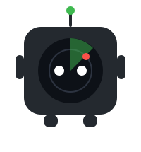
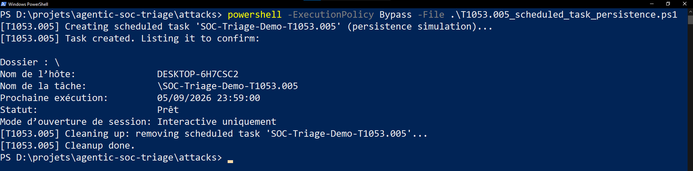
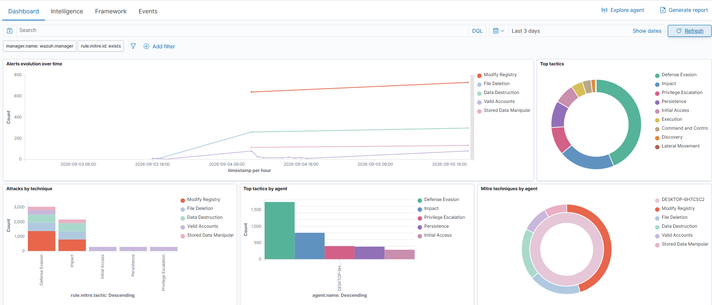
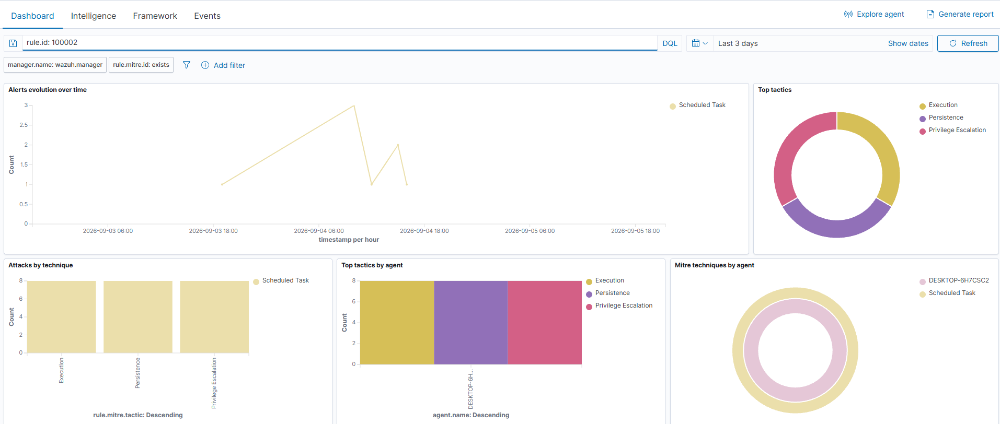
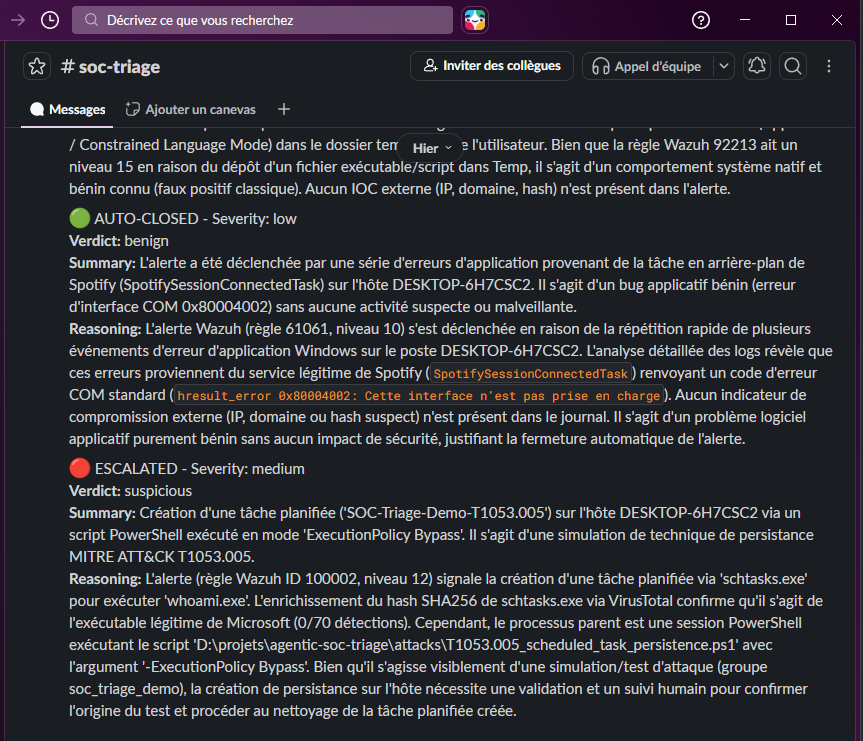
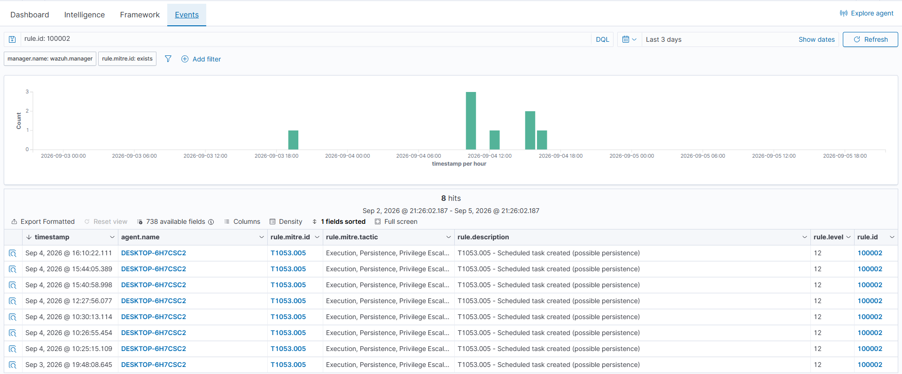
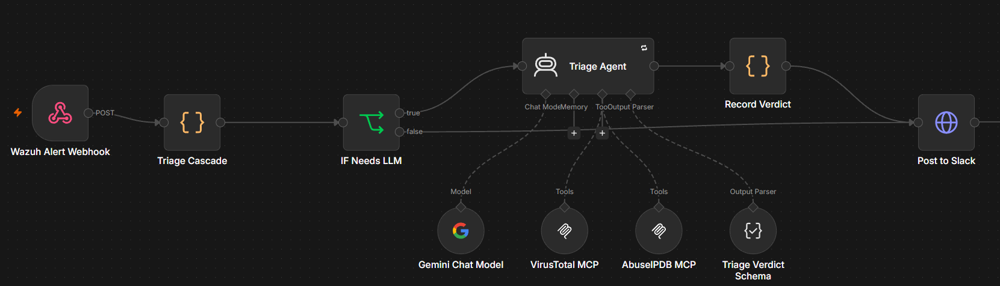

<p align="center">
  <picture>
    <source media="(prefers-color-scheme: dark)" srcset="docs/images/sentinel-dark.svg">
    
  </picture>
</p>

<h1 align="center">Agentic SOC Triage</h1>

<p align="center">
  An attack on a Windows host raises a SIEM alert. An AI agent enriches it with threat<br>
  intelligence tools it calls on its own, and a reasoned verdict lands in Slack.
</p>

<p align="center">
  
  
  
  
  
  
  
</p>

<p align="center">
  <picture>
    <source media="(prefers-color-scheme: dark)" srcset="docs/images/architecture-dark.svg">
    
  </picture>
</p>

A Tier-1 analyst spends most of their day deciding whether an alert matters. This pipeline does that
first pass end to end, on free and self-hosted tools, and escalates to a human only what deserves
one.

## The idea worth stealing

Calling a language model on every alert is slow, expensive, and unnecessary. Alerts here go through
a cascade, and only reach the model when the cheaper layers cannot settle them.

| Tier | Question | Model call |
|---|---|---|
| 0 | Seen this exact alert in the last 6 hours? | No, cached verdict replayed |
| 1 | Any indicator worth enriching? | No, settled deterministically |
| 2 | Daily budget or rate limit hit? | No, escalated as a fail-safe |
| 3 | Genuinely ambiguous | Yes |

Tier 2 matters as much as the rest. When the guard trips the alert is still escalated, with a note
saying why. A pipeline that quietly drops alerts once its budget runs out is broken, not optimised.

## What a verdict looks like

```json
{
  "severity": "medium",
  "verdict": "suspicious",
  "action": "escalate",
  "summary": "A failed SSH authentication attempt against the \"admin\" account was detected from 8.8.8.8. The IP belongs to Google's public DNS servers and has a clean reputation, but SSH connection attempts coming from that address are unusual and need a closer look.",
  "reasoning": "Wazuh rule 5710 (level 10) fired for an SSH brute force attempt against the invalid user \"admin\". Enrichment shows this is Google LLC's public DNS resolver: 0% abuse score on AbuseIPDB, 0 detections on VirusTotal. However, a public DNS server initiating SSH connections is unexplained behaviour. Without certainty, the alert cannot be auto-closed."
}
```

Both threat intelligence sources call the IP clean, so "benign, auto-close" was the easy answer. The
agent instead catches the behavioural mismatch, a public DNS resolver does not open SSH sessions,
and escalates. When in doubt, a human decides.

## See it run

An attack plants a scheduled task for persistence, MITRE T1053.005. The script is non-destructive
and cleans up after itself.

<p align="center"></p>

A real workstation is loud. Unfiltered, Wazuh shows 1,665 events in 24 hours; the custom rule brings
that to the 7 belonging to the attack.

<table>
<tr>
<td width="50%"></td>
<td width="50%"></td>
</tr>
</table>

Every alert ends in Slack. Routine false positives close themselves in green, the real persistence
attempt is escalated in red.

<p align="center"></p>

<details>
<summary>More screenshots: the matching events and the n8n workflow</summary>
<br>
<p align="center"></p>
<p align="center"></p>
</details>

## Run it

Requirements: Docker Desktop, Node.js, and a Windows host for telemetry.

```bash
cp .env.example .env      # four free API keys, links inside

cd wazuh                  # SIEM
docker compose -f generate-indexer-certs.yml run --rm generator
docker compose up -d
./deploy-integration.sh   # webhook to n8n
./deploy-config.sh        # custom rules and shared agent config

cd ../mcp-servers && npm install   # threat intel tools
node virustotal-server.js & node abuseipdb-server.js &

cd ../n8n && ./start.sh   # workflow
```

Then run any scenario in `attacks/` and watch the verdict arrive. Each one produces exactly one
level 12 alert, tagged with its MITRE technique.

## Layout

```
wazuh/         SIEM deployment, custom detection rules, webhook integration
n8n/           triage workflow, versioned as JSON
mcp-servers/   VirusTotal and AbuseIPDB servers, written against the MCP SDK
attacks/       three self-cleaning attack scenarios
docs/          design notes, decision records, screenshots
```

## Known limits

The Gemini free tier has a small daily quota. The cascade keeps usage low and the spend guard
prevents accidental exhaustion, but production use would need a paid tier. The deployment is
single-node with default Wazuh passwords: fine locally, not for anything network-reachable.

## Going deeper

[`docs/design-notes.md`](docs/design-notes.md) covers the engineering choices in detail, including
a gap in Wazuh's default ruleset that silently disables registry persistence detection.
[`docs/decisions.md`](docs/decisions.md) records the architecture decisions and what was rejected.
